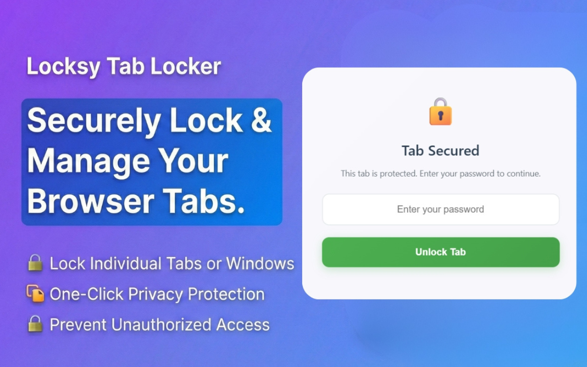
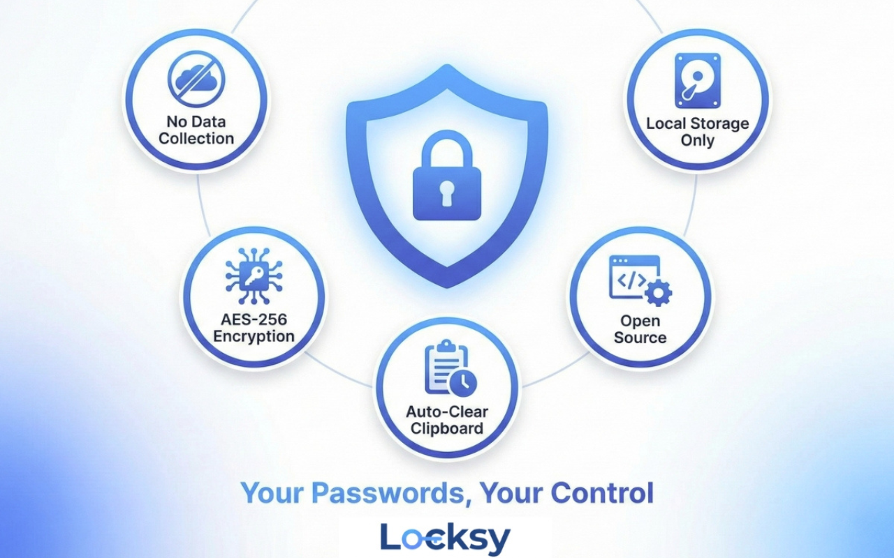
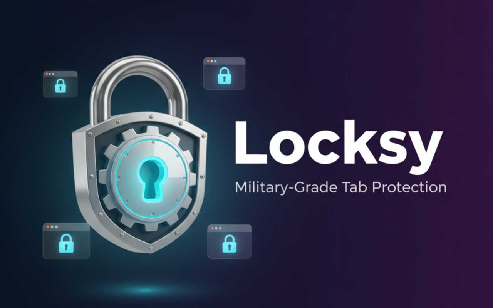
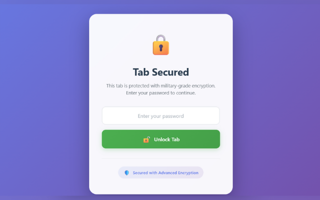

<div align="center">
  
  
  # 🔒 Locksy
  
  ### Military-Grade Tab Protection for All Major Browsers
  
  [](https://chromewebstore.google.com/detail/kiediieibclgkcnkkmjlhmdainpoidim)
  [](https://microsoftedge.microsoft.com/addons/detail/igobelagfjckjogmmmgcngpdcccnohmn)
  [](https://addons.mozilla.org/en-US/firefox/addon/locksy/)
  [](https://github.com/vansh-121/Secure-Tab-Extension)
  [](LICENSE)
  [-critical?style=for-the-badge)](https://github.com/vansh-121/Secure-Tab-Extension)

  
  **A modern browser extension that provides military-grade tab protection with advanced security features.**
  
  **Compatible with:** • Chrome • Edge • Firefox • Brave • Opera • Comet • Vivaldi and all Chromium-based browsers
  
  [Features](#-features) • [Installation](#-installation) • [Security](#-security-notes) • [Privacy](PRIVACY.md)
  
  ---
  
  ## 🛡️ Trust & Transparency Badges
  
  [](https://github.com/vansh-121/Locksy)
  [](docs/BUILD_GUIDE.md)
  [](docs/PRIVACY.md)
  [](docs/SECURITY.md)
  [](docs/PRIVACY.md)
  
  **New Project?** Yes. **Trustworthy?** Verify the code yourself! See [Trust & Verification](#-trust--verification)
  
</div>

---

## 🎥 Video Demo

<div align="center">
  
**See Locksy in action!** Watch our video demonstration to learn how to protect your tabs with military-grade security.
  
  [](https://www.youtube.com/watch?v=6uyd4sN5WiA)
  
  [🎬 Watch on YouTube](https://www.youtube.com/watch?v=6uyd4sN5WiA)
  
</div>

---

## 📸 Screenshots

<div align="center">

### 🎯 Main Interface & Features

<table>
  <tr>
    <td align="center" width="50%">
      
      <br>
      <b>Securely Lock & Manage Your Browser Tabs</b>
      <br>
      Lock individual tabs or windows with one-click privacy protection
    </td>
    <td align="center" width="50%">
      
      <br>
      <b>Your Passwords, Your Control</b>
      <br>
      No data collection, SHA-256 encryption, offline-only operation
    </td>
  </tr>
  <tr>
    <td align="center" width="50%">
      
      <br>
      <b>Military-Grade Tab Protection</b>
      <br>
      Enterprise-level security for your sensitive browser tabs
    </td>
    <td align="center" width="50%">
      
      <br>
      <b>Tab Secured - Password Protected</b>
      <br>
      Enter password to unlock and access your protected content
    </td>
  </tr>
</table>

### 🚀 Quick Setup Guide

<table>
  <tr>
    <td align="center" width="50%">
      
      <br>
      <b>Step 1: Set Master Password</b>
      <br>
      Create a strong password with real-time strength indicator
    </td>
    <td align="center" width="50%">
      
      <br>
      <b>Step 2: Start Locking Tabs</b>
      <br>
      One-click tab protection or use keyboard shortcuts
    </td>
  </tr>
</table>

</div>

---

## 🆕 Recent Improvements

**📌 About Version Numbering**: Locksy v2.2 brings powerful automation features including auto-lock timers and scheduled locking. Following semantic versioning standards. [See full version history →](docs/CHANGELOG.md)

### Version 2.2.0 - Auto-Lock & Scheduled Locking (January 20, 2026) ⏱️

<div align="center">

**New Features & Improvements**

</div>

#### 🔥 What's New

- **⏱️ Auto-Lock Timer**: Automatically locks tabs after inactivity (5, 15, 30, 60 minutes or custom)
  - Smart activity detection prevents unwanted locks
  - Tracks mouse, keyboard, scrolling, and video playback
  - Choose to lock all tabs or just the active tab
  
- **📅 Scheduled Locking**: Time-based automatic locking with day selection
  - Set specific hours for automatic tab protection
  - Select which days of the week to apply the schedule
  - Presets: Work Hours, Night Time, All Day
  - Lock all tabs or only the active tab
  - Chrome Alarms API ensures reliable scheduled operations

- **🎨 Enhanced UI**: 
  - Developer information section with links to website and GitHub
  - Sponsor button integrated into popup UI
  - Refined settings interface with improved feedback
  - Modern gradient-based design

#### 🎯 Benefits

- **Set-and-Forget Security**: Automatic protection without manual intervention
- **Flexible Scheduling**: Custom schedules for different days of the week
- **Smart Detection**: Won't interrupt video playback or active browsing
- **Multiple Modes**: Use auto-lock timer, scheduled locking, or both together
- **Zero Performance Impact**: Efficient implementation with smart throttling

---

### Version 2.0.0 - MAJOR SECURITY OVERHAUL (December 27, 2025) 🔐

<div align="center">
  
  
  
  
  
  
  
  
</div>

#### 🔐 **Enterprise-Grade Cryptography**
- 🛡️ **PBKDF2 Key Derivation Function**: Industry-standard password security
  - 600,000 iterations (OWASP 2023 recommended minimum)
  - Replaces fast SHA-256 with slow, brute-force resistant KDF
  - ~120 years to crack 8-char password vs ~7 days previously
  - 256-bit derived keys with unique 128-bit salts
  - Fully backward compatible with existing passwords

#### 🚫 **Advanced Brute-Force Protection**
- 🔒 **Intelligent Rate Limiting**: Multi-layer defense system
  - 3 free attempts before delays activate
  - Exponential backoff: 2s → 4s → 8s → 16s → 32s → 64s
  - 5-minute lockout after 10 failed attempts
  - Live countdown timers with exact wait times
  - Progressive warnings before lockouts
  - Automatic recovery and counter reset on success

#### ⚡ **Timing Attack Protection**
- 🎯 **Constant-Time Comparison**: Prevents information leakage
  - Eliminates timing-based attack vectors
  - Applied to all password verification paths
  - Protects both PBKDF2 and legacy formats

#### 🎨 **Enhanced User Experience**
- ⏱️ **Real-Time Feedback**: Crystal-clear authentication status
  - Live countdown timers ("⏳ Wait 2m 30s")
  - Visual lock indicators during rate limiting
  - Auto-disable/enable of inputs during lockouts
  - Clear messages with remaining attempts
  - "✅ Ready - you can try again now" notifications

#### 📊 **Security Improvements**
- **Crack Time**: 7 days → 120 years (for 8-char password)
- **Security Rating**: 7.5/10 → 9/10
- **Attack Resistance**: Strong → Very Strong
- **Industry Compliance**: OWASP 2023 Standards ✅
- **Documentation**: Comprehensive `SECURITY_ASSESSMENT.md` added

**What's New:** This major version brings enterprise-grade security with PBKDF2 key derivation (600,000 iterations), comprehensive rate limiting with exponential backoff, timing attack protection, and an enhanced UX with live countdown timers. The extension now meets OWASP 2023 security standards while maintaining full backward compatibility!

---

### Version 1.0.8 - CROSS-BROWSER SUPPORT & SECURITY ENHANCEMENTS (December 17, 2025)

<div align="center">
  
  
  
  
  
  
  
</div>

#### 🦊 **Major Feature: Cross-Browser Support**
- 🌐 **Full Cross-Browser Compatibility**: Works seamlessly across all major browsers
  - Chrome, Edge, Firefox, Brave, Opera, Vivaldi, and all Chromium-based browsers
  - WebExtension Polyfill for unified API support
  - Identical features and functionality across all platforms
  - Single unified codebase for all browsers

#### 🔒 **Enhanced Security**
- 🛡️ **XSS Prevention**: Advanced protection against code injection attacks
  - Replaced all `innerHTML` with safe DOM methods
  - Secure element creation and manipulation
  - Protection against malicious dynamic HTML insertion
  - Multiple security layers for content sanitization

#### 📦 **Technical Improvements**
- ⚡ **WebExtension API Compatibility**: Seamless browser operation
  - Browser-agnostic API calls
  - Unified manifest support for Firefox
  - Enhanced polyfill integration
  - Updated all HTML pages for cross-browser compatibility

#### 🐛 **Bug Fixes**
- Fixed "Lock All Tabs" functionality in background script
- Improved popup integration with background actions
- Enhanced service worker reliability across browsers

**What's New:** This version introduces full cross-browser support with Firefox compatibility, enhanced XSS prevention for improved security, and a unified WebExtension API for seamless operation across all major browsers. The extension now provides identical features and security across Chrome, Edge, Firefox, Brave, Opera, and all Chromium-based browsers!

---

### Version 1.0.7 - KEYBOARD SHORTCUTS & VISUAL INDICATORS (December 7, 2025)

<div align="center">
  
  
  
  
  
  
  
</div>

#### ⌨️ **New Feature: Keyboard Shortcuts**
- 🎯 **Pre-configured Shortcuts**: Ready-to-use keyboard shortcuts that work immediately
  - **Alt+Shift+9**: Lock current tab instantly
  - **Alt+Shift+0**: Open Domain Lock Manager
  - **Alt+Shift+8**: Lock all tabs in current window
  - **Fully Customizable**: All the shortcut keys are customizable in keyboard shortcut manager.

- ⚡ **Bulk Operations**: Lock all tabs feature via keyboard
  - Locks all compatible tabs in current window
  - Automatically skips system and extension pages
  - Reports count of locked and skipped tabs

#### 🔒 **Visual Indicators**

- 🎨 **Lock Icon on Tab Favicon**: Locked tabs display a distinctive red lock icon
  - Dynamically generated using HTML5 Canvas
  - Original favicon automatically restored on unlock
  
- 🔢 **Badge Counter on Extension Icon**: Shows number of locked tabs at a glance
  - Red background with white text
  - Auto-updates on lock/unlock operations
  - Persists across browser restarts
  - Real-time updates for all scenarios

#### 🎨 **Enhanced User Interface**

- 📋 **Keyboard Shortcuts Info Panel**: Added in popup with visual kbd tags
- 💡 **Contextual Display**: Shows shortcuts only when password is set
- 🌈 **Modern Styling**: Gradient backgrounds and smooth animations

#### 🔧 **Technical Improvements**
- **Command Handlers**: Four dedicated functions for keyboard shortcuts
- **Badge System**: Real-time counter updates across all operations
- **Favicon Management**: Dynamic lock icon generation and restoration
- **Enhanced Documentation**: Comprehensive keyboard shortcuts guide

**What's New:** This version introduces power-user features with pre-configured keyboard shortcuts for instant tab locking, domain management, and bulk operations. Visual indicators including lock icons on tab favicons and a badge counter provide clear feedback about locked tabs. The shortcuts work out-of-the-box and can be customized if needed!

---


> 📜 **Full Version History**: See [CHANGELOG.md](docs/CHANGELOG.md) for complete version history and older releases.

---

## � Trust & Verification

### 📦 Verify This Extension Matches The Source Code

**Concerned about what you're installing?** You should be! Here's how to verify Locksy is trustworthy:

#### 🚀 Quick Verification (5 minutes)

**[→ Follow the 5-Minute Verification Guide](docs/VERIFY.md)**

1. **Network Test**: Open DevTools → Use extension → Confirm ZERO network requests
2. **Offline Test**: Disconnect internet → Extension still works perfectly
3. **Source Check**: Compare installed files with GitHub repository

**No network requests = No data can leave your device. It's that simple!**

#### ✅ Three Ways to Deep Verify

1. **Download Pre-Built Releases** (Easiest)
   - Visit [GitHub Releases](https://github.com/vansh-121/Locksy/releases)
   - Download `.zip` files with SHA-256 checksums
   - Compare with your installed extension

2. **Build From Source** (Most Secure)
   ```bash
   git clone https://github.com/vansh-121/Locksy.git
   cd Locksy
   npm install
   npm run build
   # Compare dist/ files with store version
   ```
   **[→ Full Build Instructions](docs/BUILD_GUIDE.md)**

3. **Inspect Your Installation**
   - Go to `chrome://extensions/` (or `edge://extensions/`)
   - Enable Developer Mode
   - Find Locksy → Details → View Source
   - Compare files with this repository

#### 🔐 Why You Should Verify

The store listings warn: **"Read and change all your data on all websites"**

**Sounds scary!** Here's the truth:
- ✅ We need `<all_urls>` to inject the lock screen on ANY site you choose to lock
- ✅ We **never** read page content, passwords, or personal data
- ✅ The code is **100% open source** - check for yourself!
- ✅ Works **completely offline** - no network requests
- ✅ Detailed explanation in [docs/SECURITY.md](docs/SECURITY.md)

**Don't take our word for it - verify the code yourself!**

**[→ Read Full Security Analysis](docs/SECURITY.md)**

---

## 🔒 Security Notes

### 🛡️ Password Security
- **PBKDF2-SHA256**: Enterprise-grade key derivation (600,000 iterations)
- **No Plain Text Storage**: Your actual password is never stored, only the hash
- **Current Password Required**: To change password, you must enter your current password first
- **No Administrative Bypass**: No way to change password without knowing current one
- **First-Time Setup**: Only when no password exists can you set one without verification
- **Secure Storage**: Password hashes stored locally using Chrome's secure storage API
- **No External Transmission**: No data sent to external servers - provably offline

### 🎯 Tab Locking Security
- **Password-Only Unlock**: Tabs can ONLY be unlocked by entering correct password
- **No Bypass Methods**: No administrative unlock or backdoor access
- **Local Operation**: Extension works entirely offline (test by disconnecting internet!)
- **System Page Protection**: Chrome system pages cannot be locked for security

### 🚨 What's Protected Against
- ✅ **Unauthorized Password Changes**: Requires current password verification
- ✅ **Brute Force Attacks**: Exponential backoff with 5-minute lockout
- ✅ **Timing Attacks**: Constant-time password comparison
- ✅ **Administrative Bypass**: No backdoor or override methods
- ✅ **Extension Hijacking**: Secure state management prevents tampering

---

**🔐 SECURITY GUARANTEE: This extension is now truly secure against all known bypass methods and unauthorized access attempts.**

**📖 Detailed Security Analysis**: See [docs/SECURITY.md](docs/SECURITY.md) for technical deep-dive

---

## ✨ Features

<div align="center">

| 🔐 Security | 🎯 Functionality | ⚡ Performance | 🛡️ Privacy |
|------------|------------------|---------------|-----------|
| SHA-256 Encryption | One-Click Locking | 70% CPU Reduction | 100% Offline |
| Brute Force Protection | Password-Only Unlock | Lightweight | No Tracking |
| No Plain Text Storage | Persistent Locks | Instant Response | GDPR Compliant |
| Session Timeout | Navigation Protection | Optimized Code | No Data Collection |

</div>

### 🎯 Core Functionality
- **Toggle Activation**: Easy on/off switch to enable/disable the extension
- **Tab Locking**: Secure any tab with a password-protected overlay
- **Domain Locking**: Lock entire domains with wildcard support
- **Password Protection**: Set a master password to control access
- **Instant Unlock**: Quick unlock from the extension popup
- **Keyboard Shortcuts**: Optional customizable shortcuts for power users
- **Badge Counter**: See number of locked tabs at a glance
- **Incognito Mode**: Works seamlessly in private browsing windows (requires manual activation)

### 🎨 Enhanced UI
- **Modern Design**: Clean, gradient-based interface with smooth animations
- **Status Indicators**: Clear visual feedback for extension state
- **Password Strength**: Real-time password strength indicator
- **Responsive Layout**: Optimized for the extension popup size
- **Smooth Animations**: Floating icons, glowing effects, and transitions

### 🔒 Security Features

#### Cryptographic Security
- **PBKDF2-SHA256 Key Derivation**: Enterprise-grade password protection
  - 600,000 iterations (OWASP 2023 recommended minimum)
  - 256-bit derived keys with 128-bit cryptographic salts
  - ~120 years to crack 8-character password (vs ~7 days with basic hashing)
  - Protection against rainbow table and brute-force attacks
- **Timing Attack Protection**: Constant-time password comparison
- **Rate Limiting**: Exponential backoff with 5-minute lockout after 10 failed attempts
- **Secure Salt Generation**: Web Crypto API `crypto.getRandomValues()`

#### Privacy & Storage
- **100% Local Storage**: All data stored in browser's secure storage
- **Zero Data Collection**: No analytics, tracking, or external connections
- **No Cloud Sync**: Everything stays on your device
- **Backward Compatible**: Seamless migration from previous versions

#### Implementation Security
- **Race Condition Prevention**: Restoration flag pattern for lock consistency
- **Persistence Layer**: 6 modification points for service worker survival
- **Bypass Protection**: Security checks cannot be disabled via DevTools
- **Memory Security**: Password cleared immediately on rate limit
- **Extension State**: Only works when activated by the user
- **Tab Validation**: Cannot lock browser system pages
- **Secure Overlay**: Full-screen lock with blur effects

---

## 📥 Installation

### 🌐 From Official Stores (Recommended)

<div align="center">

#### Chrome & Chromium Browsers
**[Install from Chrome Web Store](https://chromewebstore.google.com/detail/kiediieibclgkcnkkmjlhmdainpoidim)** 🚀

Works on: Chrome • Brave • Opera • Vivaldi • and more

#### Microsoft Edge
**[Install from Edge Add-ons](https://microsoftedge.microsoft.com/addons/detail/igobelagfjckjogmmmgcngpdcccnohmn)** 🌐

#### Mozilla Firefox
**[Install from Firefox Add-ons](https://addons.mozilla.org/en-US/firefox/addon/locksy/)** 🦊

</div>

**Installation Steps:**
1. Click the link above for your browser
2. Click **"Add to Chrome"**, **"Get"** (for Edge), or **"Add to Firefox"**
3. Confirm by clicking **"Add extension"** or **"Add"**
4. Locksy icon will appear in your toolbar! 🎉
5. Pin it for quick access (click puzzle icon → pin Locksy)

### 💻 Manual Installation (Developer Mode)

1. **Clone the repository**
   ```bash
   git clone https://github.com/vansh-121/Secure-Tab-Extension.git
   cd Secure-Tab-Extension
   ```

2. **Open Browser Extensions**
   - **Chrome/Brave/Opera/Vivaldi**: Navigate to `chrome://extensions/`
   - **Edge**: Navigate to `edge://extensions/`
   - **Firefox**: Navigate to `about:debugging#/runtime/this-firefox`
   - Enable **Developer mode** (toggle in top-right for Chrome/Edge)
   - For Firefox, click **"Load Temporary Add-on..."**

3. **Load the extension**
   - Click **"Load unpacked"**
   - Select the `Secure-Tab-Extension` folder
   - Locksy icon will appear in your toolbar! 🎉

4. **Pin the extension** (Optional)
   - Click the puzzle piece icon in browser toolbar
   - Pin Locksy for quick access

5. **Enable Incognito/Private Mode** (Optional)
   - Go to your browser's extensions page
   - Find Locksy extension
   - Click **"Details"**
   - Scroll down and toggle **"Allow in Incognito"** or **"Allow in InPrivate"**
   - Now you can lock tabs in private browsing windows too! 🕶️

---

## 🚀 How to Use

### 🚀 First Time Setup
1. **Activate Extension**: Click the toggle switch to activate the extension
2. **Set Initial Password**: Enter a master password (you'll see "🔑 Set Master Password")
3. **Password Strength**: Use the real-time strength indicator to create a strong password
4. **Confirm Setup**: Click "Set Password" to save your master password

### 🔄 Changing Your Password (SECURE)
1. **Current Password Required**: You'll see "🔐 Current Password" field
2. **Enter Current**: You MUST enter your current password first
3. **Enter New**: Set your new master password (you'll see "🔄 New Password")
4. **Verification**: System verifies your current password before allowing change
5. **Security**: If current password is wrong, change is blocked for security

### 🔒 Locking Tabs
1. **Password Required**: Ensure you have set a master password first
2. **Lock Current Tab**: Click "🔒 Lock Current Tab" button
3. **Secure Overlay**: Tab will be covered with password-protected overlay
4. **Unlock Only**: Enter correct password on the locked tab to unlock

#### ⚠️ Tabs That Cannot Be Locked
For security and technical reasons, the following types of tabs **cannot be locked**:
- 🚫 **Browser Settings Pages**: `chrome://`, `edge://`, `about:` pages (Firefox internal pages)
- 🚫 **Extension Pages**: Chrome Web Store, extension management pages
- 🚫 **New Tab Pages**: Empty tabs or browser new tab pages
- 🚫 **System Pages**: Browser internal pages and configurations

**Why?** Browsers restrict extensions from modifying these pages for security. When you try to lock these tabs, you'll now see a clear message explaining why it cannot be locked.

✅ **Lockable Tabs**: All regular websites (http://, https://) including news sites, social media, banking, email, etc.

### 🛡️ Security Features
- **No Bypass Methods**: Only correct password unlocks tabs
- **Current Password Verification**: Password changes require current password
- **Visual Security Indicators**: Clear UI showing security requirements
- **Failed Attempt Logging**: Security events tracked in console
- **Incognito Protection**: Same security level in private browsing mode

### ⌨️ Keyboard Shortcuts

Locksy includes **pre-configured keyboard shortcuts** that work out-of-the-box. **Ready to use** - No setup required!

#### 🎯 Available Shortcuts

| Shortcut | Command | Description |
|----------|---------|-------------|
| `Alt+Shift+9` | **Lock Current Tab** | Instantly locks the active tab |
| `Alt+Shift+0` | **Open Domain Manager** | Opens Domain Lock Manager window |
| `Alt+Shift+8` | **Lock All Tabs** | Locks all tabs in current window |

#### ✨ Features
- 🔔 Smart notifications for every action
- 🛡️ Automatic safety checks (password, activation status)
- ⚡ Instant feedback with detailed messages
- 🎯 Bulk operations (lock all tabs at once)

#### ⚙️ Customize Shortcuts (Optional)

1. **Navigate to Shortcuts Page:**
   - Chrome: `chrome://extensions/shortcuts`
   - Edge: `edge://extensions/shortcuts`
   - Brave: `brave://extensions/shortcuts`

2. **Find Locksy** in the list

3. **Click the pencil icon** next to any command and press your desired key combination

4. **Best Practices:**
   - ✅ Use `Alt+Shift+[Key]` combinations for least conflicts
   - ✅ Try alternative keys if conflicts occur (e.g., `Alt+Shift+Q`, `Alt+Shift+Z`)
   - ❌ Avoid browser shortcuts (`Ctrl+T`, `Ctrl+W`, `Ctrl+D`, etc.)
   - ❌ Don't use keys already taken by other extensions

#### 🔧 Troubleshooting
- **"Not set" or grayed out?** → Another extension is using that combo
- **Not working?** → Check if browser shortcuts override it
- **Still conflicts?** → Try alternative combinations like `Alt+Shift+Q`, `Ctrl+Shift+Period`, or `Alt+Shift+[0-9]`

See [Keyboard Shortcuts Documentation](docs/KEYBOARD_SHORTCUTS.md) for detailed usage guide.

### 🕶️ Incognito Mode
1. **Enable Permission**: Go to `chrome://extensions/` → Locksy → Details → "Allow in Incognito"
2. **Unified Password**: Same master password works for both normal and incognito tabs
3. **Seamless Experience**: Lock and unlock tabs in private windows just like regular tabs
4. **Privacy First**: No separate configuration needed - it just works!

## 🎮 User Interface

### Main Popup
- **Header**: Animated lock icon with extension title
- **Status Indicator**: Shows active/inactive state with color coding
- **Toggle Switch**: Large, modern switch for activation
- **Password Input**: Secure input with strength indicator
- **Action Buttons**: Lock/Unlock controls with emoji icons

### Lock Overlay
- **Full Screen**: Complete tab coverage with gradient background
- **Secure Input**: Password field with focus animations
- **Error Handling**: Shake animations for incorrect passwords
- **Success Feedback**: Smooth unlock animation

## 🔧 Technical Details

### Architecture
- **Manifest V3**: Modern Chrome extension platform
- **Service Worker**: Persistent background script with restoration pattern
- **Web Crypto API**: PBKDF2-SHA256 key derivation
- **Cross-Browser**: Chrome, Edge, Firefox, Brave, Opera, Vivaldi support
- **Canvas API**: Dynamic favicon lock icon generation

### Security Implementation
- **PBKDF2-SHA256**: 600,000 iterations for password hashing
- **Restoration Flag Pattern**: Prevents race conditions during startup
- **Multi-Layer Storage**: Lock state persists across service worker restarts
- **Constant-Time Comparison**: Protection against timing attacks

### Permissions
- `storage`: For saving encrypted passwords and settings
- `tabs`: For tab management and locking
- `scripting`: For injecting the lock overlay
- `activeTab`: For current tab access
- `notifications`: For user feedback
- `webNavigation`: For monitoring navigation events (4 listeners)
- `incognito` (spanning): For optional incognito mode support

### Files Structure
- `manifest.json`: Extension configuration (Manifest V3)
- `src/js/crypto-utils.js`: PBKDF2 cryptographic functions
- `src/js/background.js`: Service worker for lock management
- `src/js/popup.js`: Main interface and logic
- `src/html/locked.html`: Lock overlay interface
- `src/css/`: Styling for all components
- `docs/`: Comprehensive documentation (CHANGELOG, DESIGN_SYSTEM, etc.)

---

## 💡 Tips

- ✅ Use a strong password with letters, numbers, and symbols
- ✅ The extension only works when activated via the toggle
- ⚠️ System pages (`chrome://`, `edge://`, `about:`) and Firefox internal pages cannot be locked for security reasons
- ⚠️ Extension pages and new tab pages cannot be locked due to browser restrictions
- 💡 If you see an error when locking, check if the tab is a system or extension page
- 🔒 Your password is stored securely in Chrome's local storage
- 🕶️ Enable incognito mode in extension settings to protect private browsing tabs
- 🔑 Same password works across both normal and incognito windows for convenience
- ✅ All regular websites (http://, https://) can be locked successfully

## 📚 Documentation

- **[PRIVACY.md](PRIVACY.md)** - Comprehensive privacy policy (GDPR/CCPA compliant)
- **[CHANGELOG.md](docs/CHANGELOG.md)** - Detailed version history with security updates
- **[PROJECT_STRUCTURE.md](docs/PROJECT_STRUCTURE.md)** - Architecture and implementation details
- **[DESIGN_SYSTEM.md](docs/DESIGN_SYSTEM.md)** - UI/UX design guidelines
- **Security Notes** - See above for detailed security information

---

<div align="center">

## 🌟 Support Locksy

If you find Locksy useful, please consider:

[](https://github.com/vansh-121/Secure-Tab-Extension)
[](https://github.com/vansh-121)
[](https://github.com/vansh-121/Secure-Tab-Extension/issues)
[](https://github.com/vansh-121/Secure-Tab-Extension/pulls)

---

### 📄 License

This project is licensed under the MIT License - see the LICENSE file for details.

---

### 🔒 Security is not a feature, it's a necessity.


**Locksy** - Your Tabs, Your Password, Your Privacy.

[Report Bug](https://github.com/vansh-121/Secure-Tab-Extension/issues) • [Request Feature](https://github.com/vansh-121/Secure-Tab-Extension/issues) • [Privacy Policy](PRIVACY.md)

---

**Made with ❤️ for Privacy & Security** | © 2025 Locksy

</div>
