

  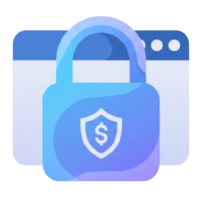
  
  # 🔒 Locksy
  
  ### Military-Grade Tab Protection for All Major Browsers
  
  
  
  
  
  
  [-critical?style=for-the-badge)](https://github.com/vansh-121/Locksy)

**A modern browser extension that provides military-grade tab protection with advanced security features.**

**Compatible with:** • Chrome • Edge • Firefox • Brave • Opera • Comet • Vivaldi and all Chromium-based browsers

[Features](#-features) • [Installation](#-installation) • [Security](#-security-notes) • [Privacy](PRIVACY.md)

> [!NOTE]
> This repository hosts the **public documentation, assets, changelogs, and issue tracker** for the Locksy browser extension. The extension itself runs entirely client-side on your local device and can be audited locally by inspecting the installed package files. Premium automation and convenience features are available via the upgraded Pro version.

## 💎 Free Tier vs. Locksy Pro

Locksy is free to use for core locking features. Upgrading to Locksy Pro (a **one-time lifetime purchase** with zero subscriptions) removes free tier restrictions and unlocks advanced browser automation and privacy features.

| Feature / Control | 🆓 Locksy Free (Core Features) | 👑 Locksy Pro (Premium Upgrade) |
| :--- | :--- | :--- |
| **Domain-Based Auto-Locks** | Max 3 Domains | **✅ Unlimited** |
| **Biometric Unlocks (Fingerprint/Face)** | Max 5 per Day | **✅ Unlimited** |
| **"Lock All Tabs" Action** | Max 3 lifetime uses | **✅ Unlimited** |
| **Intruder Photo Webcam Capture** | Max 3 Photos stored | **✅ Up to 50 Photos** |
| **Unlock All Tabs** | ❌ Not Available | **✅ 1-Click Unlock All** |
| **Startup Session Lock** | ❌ Not Available | **✅ Lock Restored Tabs on Open** |
| **Stealth Mode** | ❌ Not Available | **✅ Hide all visual traces** |
| **Custom Lock Messages** | ❌ Not Available | **✅ Custom Lock Screen Text** |
| **Weekly Privacy Reports** | ❌ Not Available | **✅ Metric Insights & Scores** |
| **Auto-Lock Timers** | Preset intervals only | **✅ Custom timer values** |
| **Scheduled Locking** | ❌ Not Available | **✅ Custom times/days lock** |
| **License Type** | Free Tier | **Lifetime Access License** |

---

## 🛡️ Trust & Privacy Badges

**New Project?** Yes. **Trustworthy?** Verify our offline-first operations! See [Security Notes](#-security-notes)

---

## ✨ Features in Action

**See Locksy in action!** Watch how each feature works with these live demonstrations.

### 🔐 Getting Started

<table>
  <tr>
    <td align="center" width="50%">
      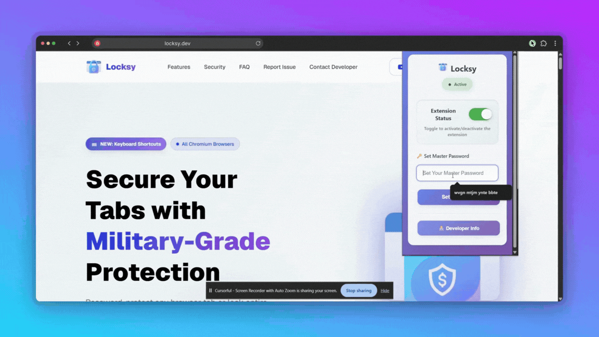
       
      <b>1️⃣ Setting Master Password</b>
       
      Create your secure master password with real-time strength indicator
    </td>
    <td align="center" width="50%">
      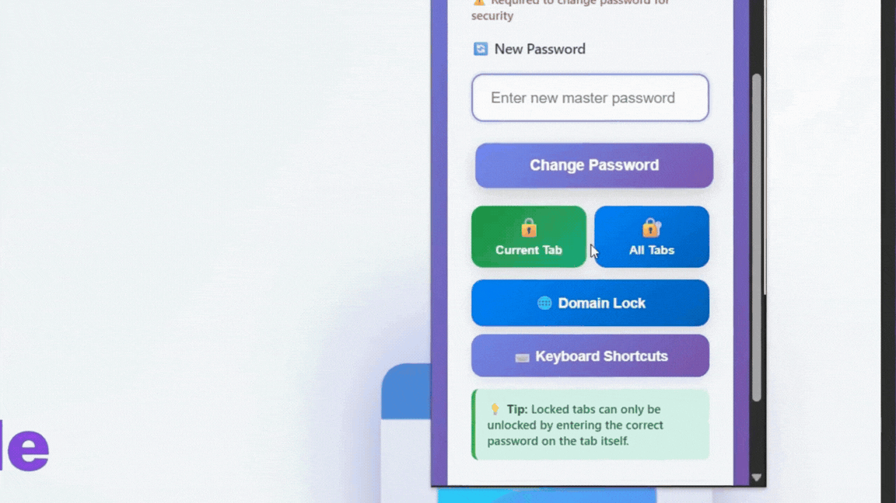
       
      <b>2️⃣ Locking Current Tab</b>
       
      One-click tab protection with instant lock overlay
    </td>
  </tr>
  <tr>
    <td align="center" width="50%">
      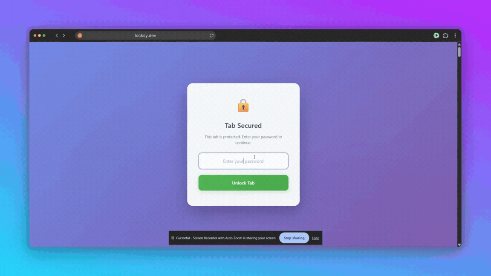
       
      <b>3️⃣ Tab Locked</b>
       
      Password-protected overlay secures your sensitive content
    </td>
    <td align="center" width="50%">
      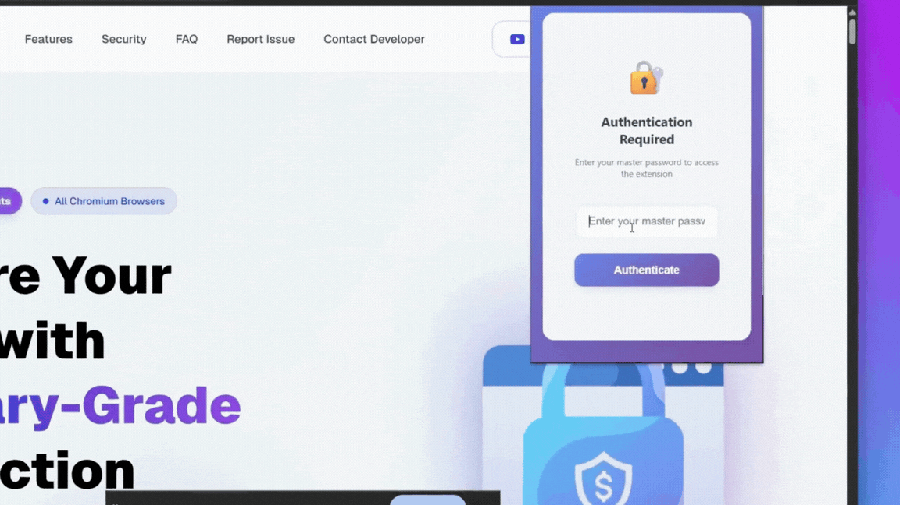
       
      <b>4️⃣ Smart Authentication Protection</b>
       
      Current password required to change settings - no bypass!
    </td>
  </tr>
</table>

### 🛡️ Advanced Features

<table>
  <tr>
    <td align="center" width="50%">
      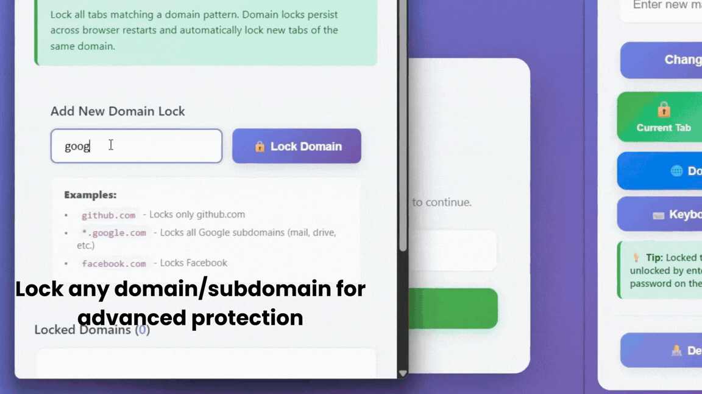
       
      <b>5️⃣ Domain & Subdomain Locking</b>
       
      Lock entire domains with wildcard support for automatic protection
    </td>
    <td align="center" width="50%">
      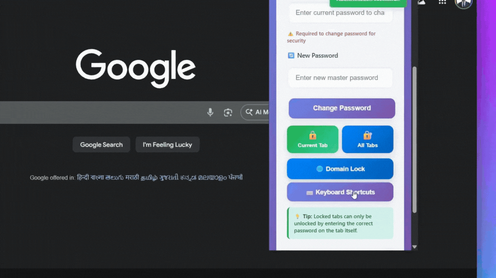
       
      <b>6️⃣ Keyboard Shortcuts</b>
       
      Pre-defined shortcuts for power users - fully customizable
    </td>
  </tr>
  <tr>
    <td align="center" width="50%">
      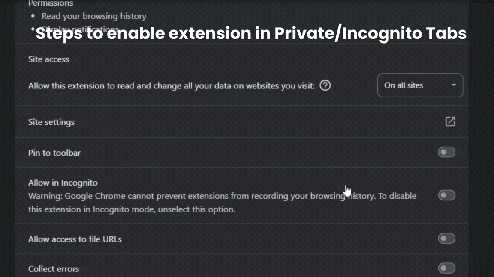
       
      <b>7️⃣ Incognito/InPrivate Mode</b>
       
      Enable Locksy in private browsing for complete privacy protection
    </td>
    <td align="center" width="50%">
      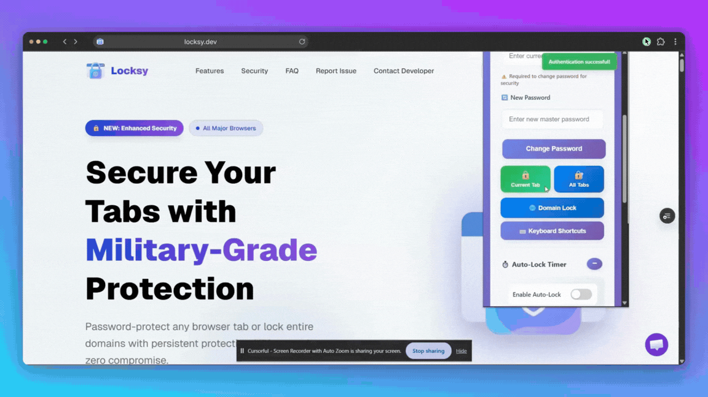
       
      <b>8️⃣ Auto Lock Timer</b>
       
      Automatic tab locking after inactivity with smart detection
    </td>
  </tr>
</table>

### ⏱️ Automation Features

<table>
  <tr>
    <td align="center" width="50%">
      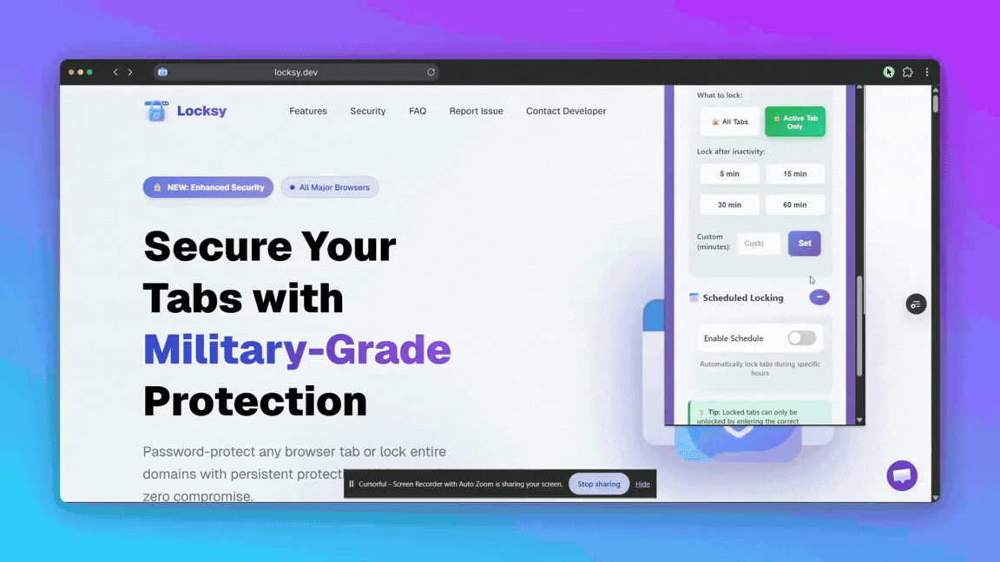
       
      <b>9️⃣ Scheduled Lock Feature</b>
       
      Time-based automatic locking with day selection and custom schedules
    </td>
    <td align="center" width="50%">
      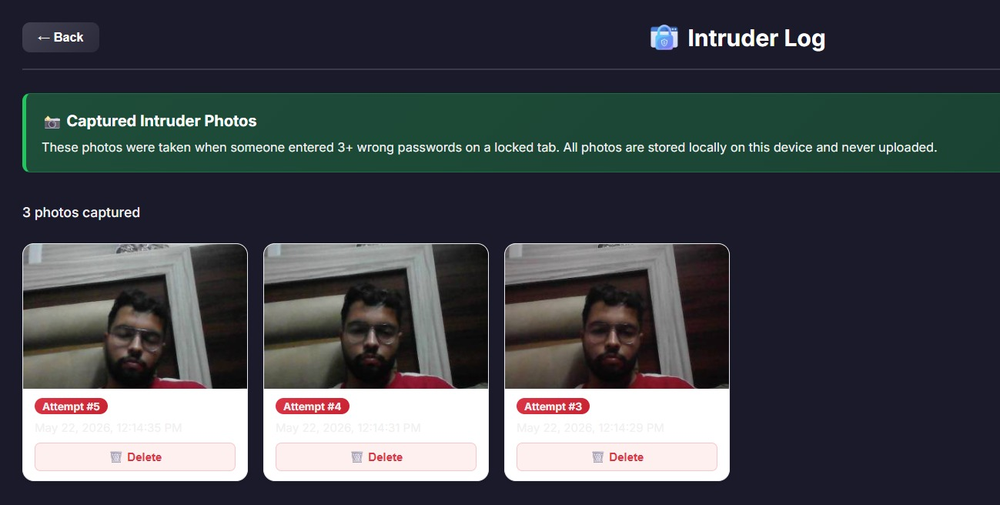
       
      <b>🔟 Intruder Detection</b>
       
      Capture local-only photos after repeated wrong password attempts
    </td>
  </tr>
</table>

---

## 📸 Screenshots

### 🎯 Main Interface & Features

<table>
  <tr>
    <td align="center" width="50%">
      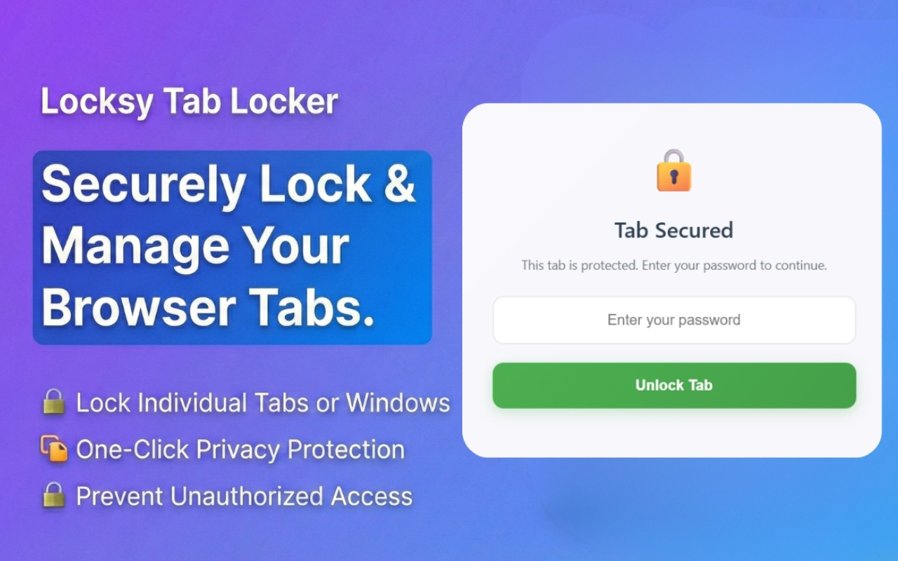
       
      <b>Securely Lock & Manage Your Browser Tabs</b>
       
      Lock individual tabs or windows with one-click privacy protection
    </td>
    <td align="center" width="50%">
      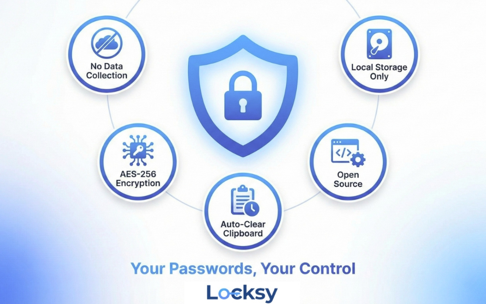
       
      <b>Your Passwords, Your Control</b>
       
      No data collection, SHA-256 encryption, offline-only operation
    </td>
  </tr>
  <tr>
    <td align="center" width="50%">
      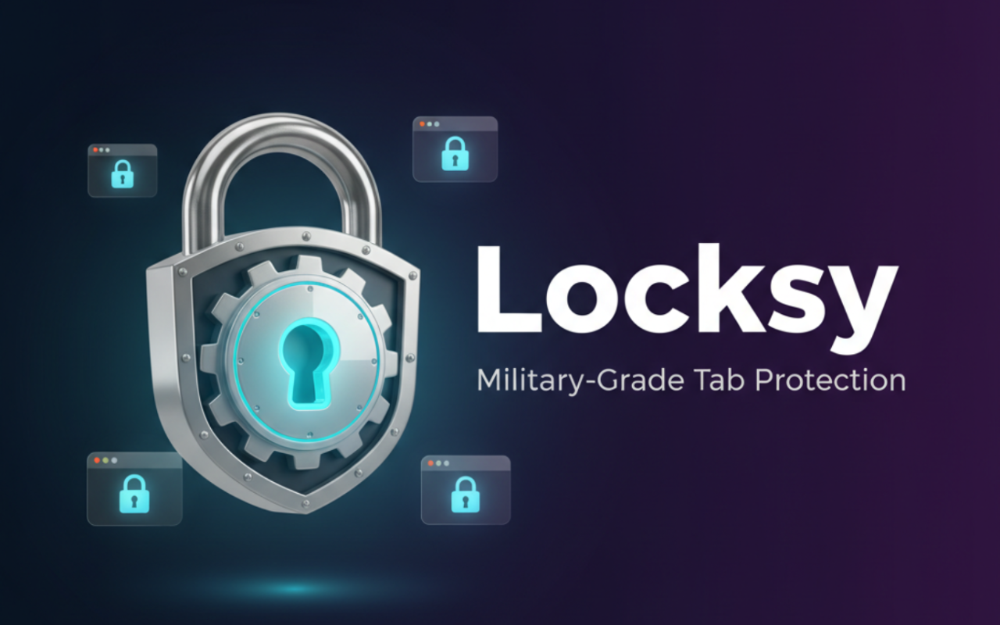
       
      <b>Military-Grade Tab Protection</b>
       
      Enterprise-level security for your sensitive browser tabs
    </td>
    <td align="center" width="50%">
      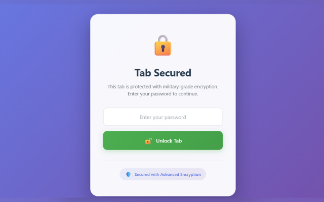
       
      <b>Tab Secured - Password Protected</b>
       
      Enter password to unlock and access your protected content
    </td>
  </tr>
</table

### 🚀 Quick Setup Guide

<table>
  <tr>
    <td align="center" width="50%">
      
       
      <b>Step 1: Set Master Password</b>
       
      Create a strong password with real-time strength indicator
    </td>
    <td align="center" width="50%">
      
       
      <b>Step 2: Start Locking Tabs</b>
       
      One-click tab protection or use keyboard shortcuts
    </td>
  </tr>
</table>

---

## 🆕 Recent Improvements

**📌 About Version Numbering**: Locksy follows semantic versioning. Each major version brings significant new capabilities. [See full version history →](docs/CHANGELOG.md)

### Version 3.0.0 - Premium UI Redesign, Weekly Privacy Reports & Polar.sh Licensing (July 18, 2026) 💎

#### 🔥 What's New

- **🎨 Stunning UI Redesign**: Enjoy a completely redesigned, premium interface with sleek glassmorphism panels, tabbed app shell navigation, and smooth micro-animations.
- **📊 Weekly Privacy Reports (PRO)**: Gain security insights with an interactive local dashboard tracking locks, unlocks, failed intrusion attempts, and overall security score history.
- **💬 Custom Lock Messages (PRO)**: Customize your lock screen overlay text. Set your own message, instructions, or warnings.
- **🚨 Intruder Notification Alerts**: Receive instant desktop alerts and browser notifications when suspicious password failures occur on locked tabs.
- **💎 Polar.sh Integration & Monetization Limits**:
  - Secure Polar license validation and activation via Cloudflare Worker backend.
  - Free Tier limits: up to 3 domain locks, 3 intruder photos, 5 biometric unlocks per day, and 3 uses of "Lock All Tabs".
  - Pro Tier: unlimited locks/biometrics/domains, Custom Lock Messages, Startup Lock, Custom Auto-Lock Timers, Stealth Mode, and Weekly Privacy Reports.
- **⚡ Automated Build Minification**: Minify JavaScript build assets with Terser to improve extension loading performance and decrease memory footprint.

---

### Version 2.7.0 - Startup Lock (July 4, 2026) 🚀

#### 🔥 What's New

- **🚀 Startup Lock**: All tabs from your last session are locked instantly when your browser starts
  - Triggers on fresh browser launch via `chrome.runtime.onStartup`
  - Works with browser **"Continue where you left off"** session restore
  - Smart session guard — locks exactly once per browser start
  - New 🚀 **Startup Lock** toggle in the popup settings
  - Requires a master password to be set

---

### Version 2.6.0 - Intruder Detection, Quick-Unlock Panel & Enhanced Biometrics (May 10, 2026) 📸

#### 🔥 What's New

- **📸 Intruder Detection**: Captures a webcam photo when someone enters the wrong password 3+ times on a locked tab
  - Photos stored 100% locally — never uploaded or transmitted
  - Dedicated **Intruder Log** page to review, delete, and manage captured photos
  - Enable in popup → 📸 Intruder Detection section; shows real-time photo count badge
  - First-time use requires allowing the browser's camera permission prompt
  - Screenshot and setup notes now show the Intruder Detection log and camera permission flow

<table>
  <tr>
    <td align="center">
      
       
      <b>Intruder Detection & Local Photo Log</b>
       
      Capture and review local-only photos after repeated wrong password attempts
       
      First-time users will see a camera permission prompt before photo capture can work
    </td>
  </tr>
</table>

- **🔒 Locked Tabs Quick-Unlock Panel**: See all locked tabs and unlock any with a single click — directly from the popup
  - No password re-entry needed (popup is already authenticated)
  - Shows favicon, title, and a 🔓 Unlock button per tab
  - Updates in real time as tabs are locked or unlocked

- **👆 Enhanced Biometric Authentication**:
  - **Biometric-Default mode**: New "Use as Default Unlock" toggle — fingerprint/face prompt fires automatically on locked pages
  - **Visibility-aware trigger**: Biometric prompt deferred until the tab is visible, fixing `NotAllowedError` loops on session restore
  - **Popup biometric auth**: Authenticate into the Locksy popup itself using fingerprint or face — no password needed

---

### Version 2.5.0 - Context Menus, Stealth Mode & Theme Toggle (April 17, 2026) 🕵️

#### 🔥 What's New

- **🖱️ Right-Click Context Menus**: Locksy actions now available directly from any tab's right-click menu
  - Lock this tab, Lock this domain, Lock all tabs in window, Toggle Stealth Mode
  - No need to open the popup for quick locking operations
    

- **🕵️ Stealth Mode**: Hide all visual evidence of Locksy from observers
  - Hides badge counter and suppresses all browser notifications
  - Toggle via popup settings, keyboard shortcut (`Alt+Shift+7`), or right-click menu
  - Locked pages remain accessible to you via triple-click or `Alt+U`
  - State persists across browser restarts

- **🎨 Manual Light/Dark Theme Toggle**: New `theme-manager.js` syncs your UI preference across all extension pages
  - Two-state toggle: Light ☀️ / Dark 🌙 — stored and applied instantly across popup, lock screen, and all pages
  - Flash-prevention: theme applied before page renders

- **🐛 Domain Lock URL Fix**: Domain locking now correctly handles `www.` prefixes and `https://` protocols

---

### Version 2.4.0 - Unlock All Tabs & Bug Fixes (February 25, 2026) 🛠️

#### 🔥 What's New

- **🔓 Unlock All Tabs**: New popup button that unlocks every locked tab simultaneously — all tabs navigate back at once in a single batch operation
- **Bug fixes & stability improvements** — temporarily unlocked tabs state now persists correctly across service worker restarts

---

### Version 2.3.0 - Biometric Authentication (February 21, 2026) 🔑

**New Features & Improvements**

#### 🔥 What's New

- **🔑 Biometric Authentication (WebAuthn)**: Unlock protected tabs with your fingerprint or face
  - Supports Windows Hello, Touch ID, Face ID, and all FIDO2-compatible authenticators
  - One-tap unlock — no more typing password every time
  - Graceful fallback to master password if biometric is unavailable
  - Toggle biometric lock on/off in settings; register/remove credential at any time
  - Zero biometric data stored — only a public-key credential ID saved locally

- **📬 Newsletter Subscription**: Subscribe to Locksy updates from within the popup

- **🎨 Responsive Design Overhaul**:
  - Lock screen fully responsive across all screen sizes and DPI levels
  - Improved popup layout and domain manager on narrow viewports
  - New biometric UI states: spinner, status badges, retry button

#### 🎯 Benefits

- **Effortless Security**: Biometrics make unlocking fast without sacrificing protection
- **Device-Native Trust**: Uses the same security chip trusted by banking apps
- **Always Backward Compatible**: Password authentication always available as fallback
- **100% Local**: WebAuthn is fully offline — no server, no cloud, no data shared

---

## 🔒 Security & Verification

### 📦 Verify Our Offline-First Operations

**Concerned about what you're installing?** You should be! Since Locksy operates as a private repository, you can still verify that the extension is safe and respects your privacy by inspecting its runtime behavior:

#### 🚀 How to Verify Locksy is Safe (5-Minute Audit)

1. **Network Audit**: Open your browser's Developer Tools (`F12`), switch to the **Network** tab, and lock/unlock your tabs. You will confirm that **ZERO network requests** are sent (except for the secure Pro license key check to our Cloudflare Worker proxy if you activate Pro).
2. **Offline Test**: Fully disconnect your device from the internet. All core features — locking, unlocking, biometrics, auto-lock timers, scheduled locks, and webcam intruder logs — continue to function perfectly offline.
3. **Inspect Local Installation**: You can audit the source files directly inside your browser:
   - Go to `chrome://extensions/` (or `edge://extensions/` / `about:debugging` in Firefox).
   - Enable **Developer Mode**.
   - Find Locksy, click **Details**, and inspect the loaded background service worker and page scripts.

#### 🔐 Why We Need the `<all_urls>` Permission
The store listings warn: *"Read and change all your data on all websites"*. 
Here is what that actually means:
- ✅ We need this permission solely to inject the secure lock overlay screen on pages you choose to lock.
- ✅ We **never** read webpage content, input text, or personal credentials.
- ✅ The extension operates **100% offline** (except for the optional Pro licensing key validation check).
- ✅ Detailed security mechanics are documented in [docs/SECURITY.md](docs/SECURITY.md).

**[→ Read Full Security Analysis](docs/SECURITY.md)**

---

## 🔒 Security Notes

### 🛡️ Password Security

- **PBKDF2-SHA256**: Enterprise-grade key derivation (600,000 iterations)
- **No Plain Text Storage**: Your actual password is never stored, only the hash
- **Current Password Required**: To change password, you must enter your current password first
- **No Administrative Bypass**: No way to change password without knowing current one
- **First-Time Setup**: Only when no password exists can you set one without verification
- **Secure Storage**: Password hashes stored locally using Chrome's secure storage API
- **No External Transmission**: No data sent to external servers - provably offline

### 🎯 Tab Locking Security

- **Password-Only Unlock**: Tabs can ONLY be unlocked by entering correct password
- **No Bypass Methods**: No administrative unlock or backdoor access
- **Local Operation**: Extension works entirely offline (test by disconnecting internet!)
- **System Page Protection**: Chrome system pages cannot be locked for security

### What's Protected Against

- ✅ **Unauthorized Password Changes**: Requires current password verification
- ✅ **Brute Force Attacks**: Exponential backoff with 5-minute lockout
- ✅ **Timing Attacks**: Constant-time password comparison
- ✅ **Administrative Bypass**: No backdoor or override methods
- ✅ **Extension Hijacking**: Secure state management prevents tampering
- ✅ **Biometric Spoofing**: Handled entirely by the OS security chip — Locksy never touches biometric data

---

**🔐 SECURITY GUARANTEE: This extension is now truly secure against all known bypass methods and unauthorized access attempts.**

**📖 Detailed Security Analysis**: See [docs/SECURITY.md](docs/SECURITY.md) for technical deep-dive

---

## ✨ Features

| 🔐 Security            | 🎯 Functionality      | ⚡ Performance    | 🛡️ Privacy          |
| ---------------------- | --------------------- | ----------------- | ------------------- |
| SHA-256 Encryption     | One-Click Locking     | 70% CPU Reduction | Offline-First       |
| Brute Force Protection | Password-Only Unlock  | Lightweight       | No Tracking         |
| No Plain Text Storage  | Persistent Locks      | Instant Response  | GDPR Compliant      |
| Session Timeout        | Navigation Protection | Optimized Code    | No Data Collection  |
| Biometric (WebAuthn)   | Biometric Unlock      | Native OS Speed   | Zero Biometric Data |
| Stealth Mode           | Right-Click Menus     | Theme Toggle      | No Badge Leakage    |
| Intruder Detection     | Quick-Unlock Panel    | Real-time Panel   | Local Photos Only   |

### 🎯 Core Functionality

- **Toggle Activation**: Easy on/off switch to enable/disable the extension
- **Tab Locking**: Secure any tab with a password-protected overlay
- **Biometric Unlock**: Unlock tabs with fingerprint, Face ID, Touch ID, or Windows Hello via WebAuthn (5/day on Free Core, unlimited on Pro)
- **Domain Locking**: Lock entire domains with wildcard support (Up to 3 domains on Free Core, unlimited on Pro)
- **Password Protection**: Set a master password using PBKDF2 cryptographic hashing
- **Instant Unlock**: Quick unlock from the extension popup
- **Right-Click Context Menus**: Lock tab, domain, all tabs, or toggle stealth — without opening the popup
- **Stealth Mode (PRO)**: Hide badge counter and suppress all lock-state notifications from observers
- **Startup Lock (PRO)**: Automatically lock restored tabs on browser startup
- **Intruder Detection**: Capture a local webcam photo after repeated failed unlock attempts (Up to 3 photos on Free Core, up to 50 on Pro)
- **Keyboard Shortcuts**: Pre-configured shortcuts for power users (including Alt+Shift+7 for Stealth Mode)
- **Badge Counter**: See number of locked tabs at a glance (hidden automatically in Stealth Mode)
- **Incognito Mode**: Works seamlessly in private browsing windows (requires manual activation)
- **Unlock All Tabs (PRO)**: Single button to release every locked tab simultaneously
- **Locked Tabs Quick-Unlock Panel**: See all locked tabs in the popup and unlock any with one click — no password re-entry
- **Weekly Privacy Reports (PRO)**: Dashboard showing security scores, weekly metrics charts, and timeline logs
- **Custom Lock Messages (PRO)**: Display personalized messages or notes on locked tab overlays
- **Intruder Log**: Review and delete captured intruder photos from a dedicated local-only log page

### 🎨 Enhanced UI

- **Modern Design**: Clean, gradient-based interface with smooth animations
- **Manual Light/Dark Theme**: Persistent two-state theme toggle (☀️ Light / 🌙 Dark) synced across all extension pages
- **Status Indicators**: Clear visual feedback for extension state
- **Password Strength**: Real-time password strength indicator
- **Responsive Layout**: Optimized for the extension popup size
- **Smooth Animations**: Floating icons, glowing effects, and transitions
- **Collapsible Settings Panels**: Auto-Lock, Scheduled Lock, Biometric, and Stealth sections each collapse independently

### 🔒 Security Features

#### Cryptographic Security

- **PBKDF2-SHA256 Key Derivation**: Enterprise-grade password protection
  - 600,000 iterations (OWASP 2023 recommended minimum)
  - 256-bit derived keys with 128-bit cryptographic salts
  - ~120 years to crack 8-character password (vs ~7 days with basic hashing)
  - Protection against rainbow table and brute-force attacks
- **Biometric Authentication (WebAuthn / FIDO2)**: Device-native unlock
  - Supports Windows Hello, Touch ID, Face ID, and all FIDO2-compatible platform authenticators
  - Zero biometric data stored by Locksy — only a public-key credential ID saved locally
  - Fully local — no server, no cloud, no data transmitted
  - Password fallback always available
  - Detailed in [docs/SECURITY.md](docs/SECURITY.md)
- **Timing Attack Protection**: Constant-time password comparison
- **Rate Limiting**: Exponential backoff with 5-minute lockout after 10 failed attempts
- **Secure Salt Generation**: Web Crypto API `crypto.getRandomValues()`

#### Privacy & Storage

- **100% Local Storage**: All settings, locked tab maps, intruder photo captures, and privacy score histories are stored securely on your local device.
- **Privacy-First Model**: Core locking, biometrics, intruder capture, and local photo logging operate completely offline. Pro licensing uses secure verification requests (no browsing data or passwords sent).
- **No Cloud Sync**: Your data never leaves your device and is not synchronized to external servers.
- **Backward Compatible**: Seamless migration from previous versions

#### Implementation Security

- **Race Condition Prevention**: Restoration flag pattern for lock consistency
- **Persistence Layer**: 6 modification points for service worker survival
- **Bypass Protection**: Security checks cannot be disabled via DevTools
- **Memory Security**: Password cleared immediately on rate limit
- **Extension State**: Only works when activated by the user
- **Tab Validation**: Cannot lock browser system pages
- **Secure Overlay**: Full-screen lock with blur effects

---

## 📥 Installation

### 🌐 From Official Stores (Recommended)

#### Chrome & Chromium Browsers

**[Install from Chrome Web Store](https://chromewebstore.google.com/detail/kiediieibclgkcnkkmjlhmdainpoidim)** 🚀

Works on: Chrome • Brave • Opera • Vivaldi • and more

#### Microsoft Edge

**[Install from Edge Add-ons](https://microsoftedge.microsoft.com/addons/detail/igobelagfjckjogmmmgcngpdcccnohmn)** 🌐

#### Mozilla Firefox

**[Install from Firefox Add-ons](https://addons.mozilla.org/en-US/firefox/addon/locksy/)** 🦊

**Installation Steps:**

1. Click the link above for your browser
2. Click **"Add to Chrome"**, **"Get"** (for Edge), or **"Add to Firefox"**
3. Confirm by clicking **"Add extension"** or **"Add"**
4. Locksy icon will appear in your toolbar! 🎉
5. Pin it for quick access (click puzzle icon → pin Locksy)

### 🕶️ Enable Incognito/Private Mode (Optional)

If you want to protect tabs in private browsing windows:
1. Go to your browser's extensions page (`chrome://extensions/` or `edge://extensions/`).
2. Locate the **Locksy** extension and click **Details**.
3. Scroll down and toggle **"Allow in Incognito"** (or **"Allow in InPrivate"**).

---

## 🚀 How to Use

### 🚀 First Time Setup

1. **Activate Extension**: Click the toggle switch to activate the extension
2. **Set Initial Password**: Enter a master password (you'll see "🔑 Set Master Password")
3. **Password Strength**: Use the real-time strength indicator to create a strong password
4. **Confirm Setup**: Click "Set Password" to save your master password

### 🔄 Changing Your Password (SECURE)

1. **Current Password Required**: You'll see "🔐 Current Password" field
2. **Enter Current**: You MUST enter your current password first
3. **Enter New**: Set your new master password (you'll see "🔄 New Password")
4. **Verification**: System verifies your current password before allowing change
5. **Security**: If current password is wrong, change is blocked for security

### 🔒 Locking Tabs

1. **Password Required**: Ensure you have set a master password first
2. **Lock Current Tab**: Click "🔒 Lock Current Tab" button in the popup  
   **— or —** Right-click any page → Locksy → 🔒 Lock this tab
3. **Secure Overlay**: Tab will be covered with password-protected overlay
4. **Unlock Only**: Enter correct password on the locked tab to unlock

#### ⚠️ Tabs That Cannot Be Locked

For security and technical reasons, the following types of tabs **cannot be locked**:

- 🚫 **Browser Settings Pages**: `chrome://`, `edge://`, `about:` pages (Firefox internal pages)
- 🚫 **Extension Pages**: Chrome Web Store, extension management pages
- 🚫 **New Tab Pages**: Empty tabs or browser new tab pages
- 🚫 **System Pages**: Browser internal pages and configurations

**Why?** Browsers restrict extensions from modifying these pages for security. When you try to lock these tabs, you'll now see a clear message explaining why it cannot be locked.

✅ **Lockable Tabs**: All regular websites (http://, https://) including news sites, social media, banking, email, etc.

### 🖱️ Right-Click Context Menus

Lock without ever opening the popup — just right-click on any webpage:

| Menu Item                       | Action                                          |
| ------------------------------- | ----------------------------------------------- |
| 🔒 Lock this tab                | Locks the current tab instantly                 |
| 🌐 Lock this domain             | Adds the site's domain to your domain lock list |
| 📂 Lock all tabs in this window | Bulk-locks every compatible tab in the window   |
| 👁️ Toggle Stealth Mode          | Flips stealth on/off without opening the popup  |

- All actions perform the same password and system-page safety checks as the popup
- Context menus re-register automatically after the browser restarts

### 🕵️ Stealth Mode

Hide every visible trace of Locksy from anyone looking over your shoulder:

1. **Enable via Popup**: Open popup → scroll to "🕵️ Stealth Mode" section → toggle on
2. **Enable via Shortcut**: Press `Alt+Shift+7` at any time
3. **Enable via Right-Click**: Right-click → Locksy → 👁️ Toggle Stealth Mode

**What stealth hides:**

- 🔕 Badge counter on the extension icon (no locked-tab count visible)
- 🔕 All browser notifications from Locksy

**What stealth does NOT affect:**

- ✅ Lock protection still fully active — tabs remain locked
- ✅ Locked pages accessible to you: triple-click the error text or press `Alt+U`
- ✅ Disabling stealth shows a brief confirmation notification

### 📸 Intruder Detection

Capture evidence of repeated failed unlock attempts without sending anything off-device:

1. **Enable via Popup**: Open popup → scroll to "📸 Intruder Detection" → toggle on
2. **Allow Camera Permission**: On first use, the browser will ask for camera access before Locksy can capture photos
3. **Trigger Condition**: Photos are captured from the 3rd wrong password attempt and later failed attempts
4. **Review Locally**: Open the Intruder Log to view or delete captured photos

**Privacy note:** Photos stay in local browser storage only. Locksy does not upload, sync, or transmit them.

### 🎨 Switching Theme (Light / Dark)

1. Click the **☀️ / 🌙 button** in the popup header to toggle between Light and Dark mode
2. Your preference is saved and applied instantly across **all** extension pages
3. On first use, the theme seeds from your OS preference, then stays as you last set it

### 🛡️ Security Features

- **No Bypass Methods**: Only correct password unlocks tabs
- **Current Password Verification**: Password changes require current password
- **Visual Security Indicators**: Clear UI showing security requirements
- **Failed Attempt Logging**: Security events tracked in console
- **Incognito Protection**: Same security level in private browsing mode

### ⌨️ Keyboard Shortcuts

Locksy includes **pre-configured keyboard shortcuts** that work out-of-the-box. **Ready to use** - No setup required!

#### 🎯 Available Shortcuts

| Shortcut      | Command                 | Description                          |
| ------------- | ----------------------- | ------------------------------------ |
| `Alt+Shift+9` | **Lock Current Tab**    | Instantly locks the active tab       |
| `Alt+Shift+0` | **Open Domain Manager** | Opens Domain Lock Manager window     |
| `Alt+Shift+8` | **Lock All Tabs**       | Locks all tabs in current window     |
| `Alt+Shift+7` | **Toggle Stealth Mode** | Hides/shows lock indicators silently |

#### ✨ Features

- 🔔 Smart notifications for every action
- 🛡️ Automatic safety checks (password, activation status)
- ⚡ Instant feedback with detailed messages
- 🎯 Bulk operations (lock all tabs at once)

#### ⚙️ Customize Shortcuts (Optional)

1. **Navigate to Shortcuts Page:**
   - Chrome: `chrome://extensions/shortcuts`
   - Edge: `edge://extensions/shortcuts`
   - Brave: `brave://extensions/shortcuts`

2. **Find Locksy** in the list

3. **Click the pencil icon** next to any command and press your desired key combination

4. **Best Practices:**
   - ✅ Use `Alt+Shift+[Key]` combinations for least conflicts
   - ✅ Try alternative keys if conflicts occur (e.g., `Alt+Shift+Q`, `Alt+Shift+Z`)
   - ❌ Avoid browser shortcuts (`Ctrl+T`, `Ctrl+W`, `Ctrl+D`, etc.)
   - ❌ Don't use keys already taken by other extensions

#### 🔧 Troubleshooting

- **"Not set" or grayed out?** → Another extension is using that combo
- **Not working?** → Check if browser shortcuts override it
- **Still conflicts?** → Try alternative combinations like `Alt+Shift+Q`, `Ctrl+Shift+Period`, or `Alt+Shift+[0-9]`

See [Keyboard Shortcuts Documentation](docs/KEYBOARD_SHORTCUTS.md) for detailed usage guide.

### 🕶️ Incognito Mode

1. **Enable Permission**: Go to `chrome://extensions/` → Locksy → Details → "Allow in Incognito"
2. **Unified Password**: Same master password works for both normal and incognito tabs
3. **Seamless Experience**: Lock and unlock tabs in private windows just like regular tabs
4. **Privacy First**: No separate configuration needed - it just works!

## 🎮 User Interface

### Main Popup

- **Header**: Animated lock icon, extension title, and **Light/Dark theme toggle**
- **Status Indicator**: Shows active/inactive state with color coding
- **Toggle Switch**: Large, modern switch for activation
- **Password Input**: Secure input with strength indicator
- **Action Buttons**: Lock Current Tab, Lock All Tabs, Unlock All Tabs, Domain Lock
- **Biometric Section**: Collapsible panel for enabling/disabling WebAuthn unlock
- **Auto-Lock Section**: Collapsible timer settings with scope and duration controls
- **Scheduled Lock Section**: Collapsible schedule with time inputs, day selector, and presets
- **Stealth Mode Section**: Collapsible toggle with info panel showing keyboard shortcut
- **Intruder Detection Section**: Camera-permission aware toggle with local photo count and Intruder Log access
- **Developer Info & Sponsor**: Footer buttons for support and developer links

### Lock Overlay

- **Full Screen**: Complete tab coverage with gradient background
- **Navigation Shell**: Theme toggle and branding bar at the top of the locked page
- **Biometric Prompt**: One-tap fingerprint/face unlock (when biometric is enabled)
- **Secure Input**: Password field with focus animations
- **Intruder Capture**: Repeated wrong passwords can trigger local-only photo capture when enabled
- **Error Handling**: Shake animations for incorrect passwords
- **Success Feedback**: Smooth unlock animation

### Right-Click Menu

- **Parent Menu**: "Locksy - Tab Locker 🔐" groups all actions
- **Four Actions**: Lock tab, Lock domain, Lock all, Toggle stealth
- **Context-Aware**: Works on page, link, image, selection, and editable areas

## 🔧 Permissions

- `storage`: For saving encrypted passwords, settings, and preferences
- `tabs`: For tab management and locking
- `activeTab`: For current tab access
- `notifications`: For user feedback (suppressed in Stealth Mode)
- `webNavigation`: For monitoring navigation events
- `alarms`: For scheduled locking
- `contextMenus`: For right-click context menu actions
- `incognito` (spanning): For optional incognito mode support

---

## 💡 Tips

- ✅ Use a strong password with letters, numbers, and symbols
- ✅ The extension only works when activated via the toggle
- ⚠️ System pages (`chrome://`, `edge://`, `about:`) and Firefox internal pages cannot be locked for security reasons
- ⚠️ Extension pages and new tab pages cannot be locked due to browser restrictions
- 💡 If you see an error when locking, check if the tab is a system or extension page
- 🔒 Your password is stored securely in Chrome's local storage
- 🕶️ Enable Stealth Mode (`Alt+Shift+7`) to hide lock indicators from people around you
- 🖱️ Right-click any page for quick Locksy actions — no need to open the popup
- 🌐 Domain lock: entering `youtube.com` automatically matches `www.youtube.com` too
- 🎨 Use the ☀️/🌙 button in the popup header to switch between Light and Dark mode
- 🕶️ Enable incognito mode in extension settings to protect private browsing tabs
- 🔑 Same password works across both normal and incognito windows for convenience
- ✅ All regular websites (http://, https://) can be locked successfully

## 📚 Documentation

- **[PRIVACY.md](docs/PRIVACY.md)** - Comprehensive privacy policy (GDPR/CCPA compliant)
- **[SECURITY.md](docs/SECURITY.md)** - Security verification details and audits
- **[KEYBOARD_SHORTCUTS.md](docs/KEYBOARD_SHORTCUTS.md)** - Guide to customizing Locksy keyboard hotkeys
- **[CHANGELOG.md](docs/CHANGELOG.md)** - Detailed version history with all recent updates

---

## 🌟 Support Locksy

If you find Locksy useful, please consider:

---

### 📄 License

This project is licensed under the MIT License - see the LICENSE file for details.

---

### 🔒 Security is not a feature, it's a necessity.

**Locksy** - Your Tabs, Your Password, Your Privacy.

[Report Bug](https://github.com/vansh-121/Locksy/issues) • [Request Feature](https://github.com/vansh-121/Locksy/issues) • [Privacy Policy](docs/PRIVACY.md)

---

**Made with ❤️ for Privacy & Security** | © 2026 Locksy

